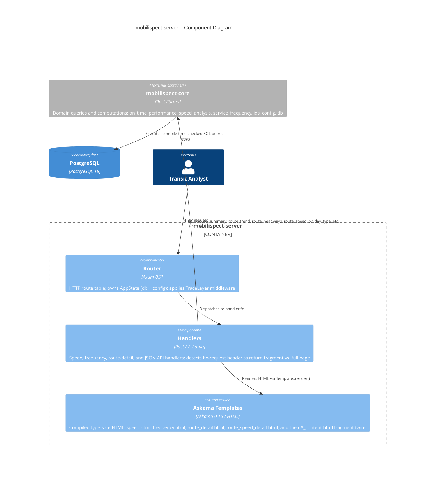
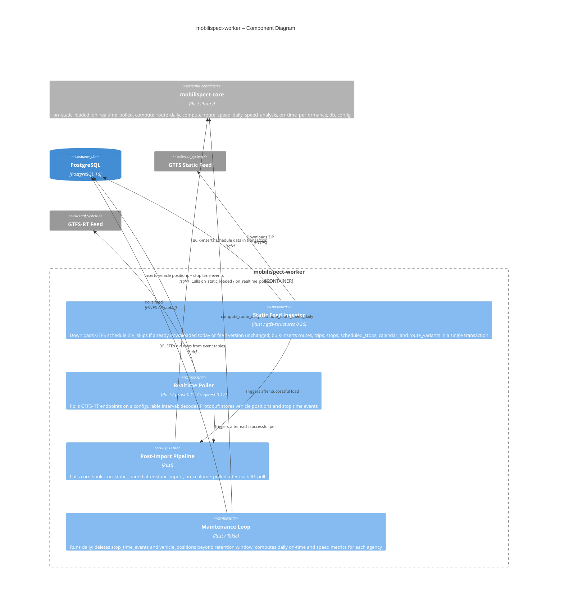

<!-- architecture: auto-generated — edit the Mermaid block only, keep other text -->
# Mobilispect – Component Diagrams

> Last updated: 2026-05-26

Component-level detail for the two deployable binaries. The shared `mobilispect-core` library is shown as an external container in each diagram because it is statically linked into both binaries rather than deployed independently.

## mobilispect-server

The server is a thin Axum application. Handlers query the core library for domain data and render it through Askama templates. HTMX requests receive HTML fragments; plain requests receive full pages. The router also exposes two JSON endpoints for JavaScript chart data.

## mobilispect-worker

The worker spawns three long-running Tokio task groups per configured agency: a one-shot static import, a polling realtime ingestor, and a daily maintenance loop. A lightweight pipeline module wires static and realtime events into metric computation hooks in `mobilispect-core`.

<!-- manually maintained: add notes, decisions, or ADRs below this line -->
