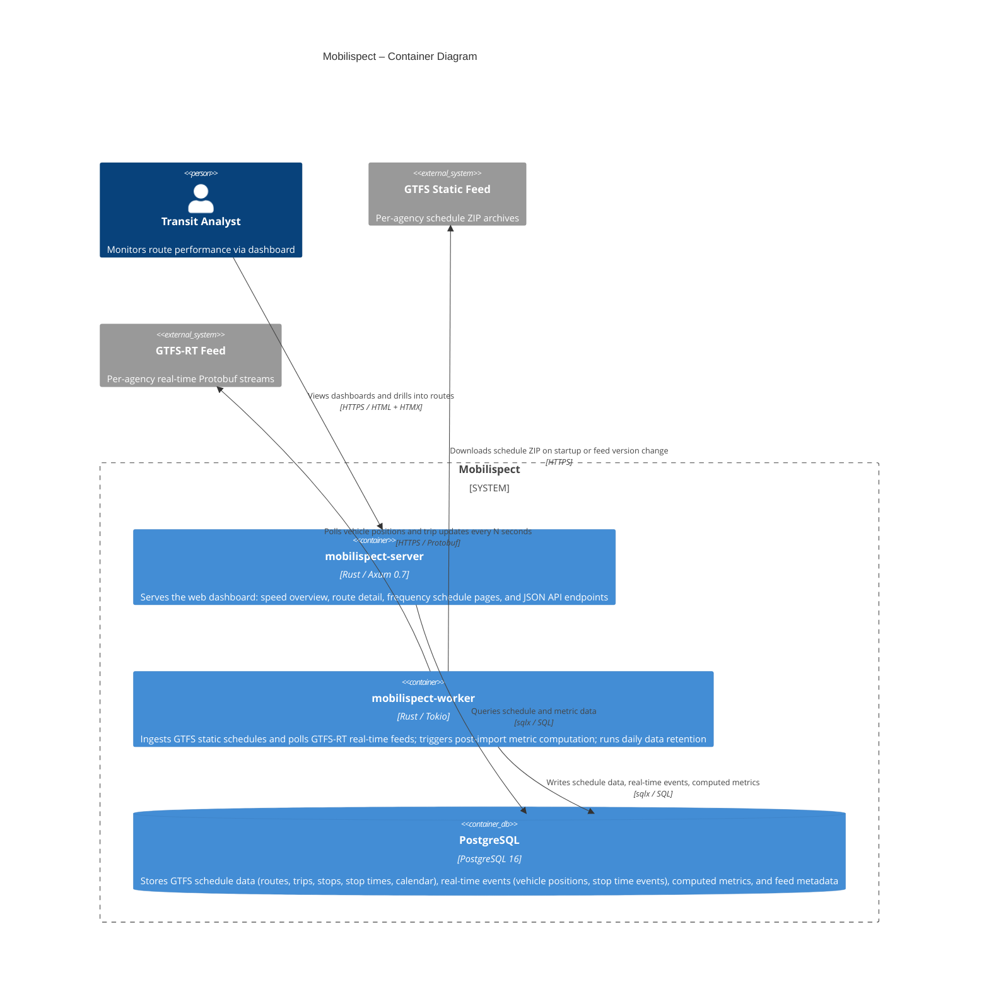

<!-- architecture: auto-generated — edit the Mermaid block only, keep other text -->
# Mobilispect – Container Diagram

> Last updated: 2026-05-26

Three deployable units make up Mobilispect: a web server binary, a background worker binary, and a PostgreSQL database. Both binaries link against `mobilispect-core`, a Rust library crate that holds all shared domain logic (queries, computations, configuration, ID types). The server and worker never communicate with each other directly — the database is their only shared state.

<!-- manually maintained: add notes, decisions, or ADRs below this line -->
