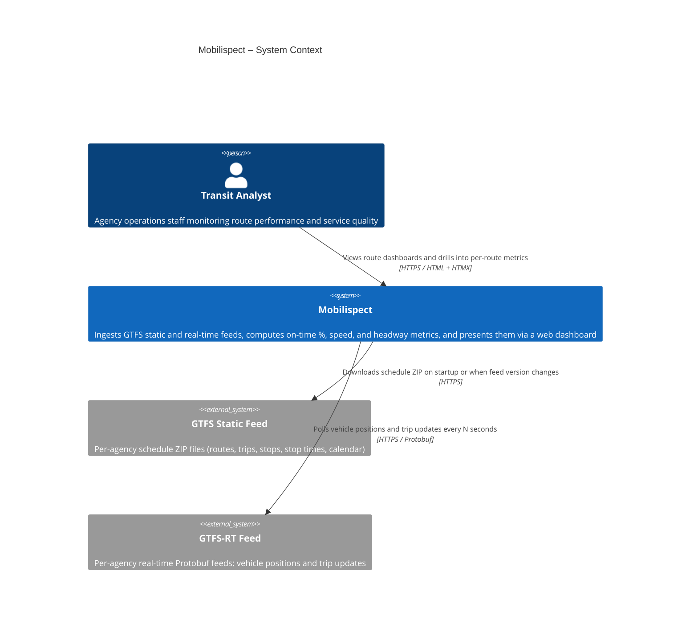

<!-- architecture: auto-generated — edit the Mermaid block only, keep other text -->
# Mobilispect – System Context

> Last updated: 2026-05-26

Mobilispect is a transit performance monitoring system. Transit analysts and agency operations staff use its web dashboard to track on-time performance, route speed, and service frequency. The system ingests two external data sources: GTFS static schedule feeds (downloaded as ZIP archives from agency servers) and GTFS-RT real-time feeds (polled as Protobuf streams). Both are consumed entirely within Mobilispect — external consumers receive nothing from this system.

<!-- manually maintained: add notes, decisions, or ADRs below this line -->
