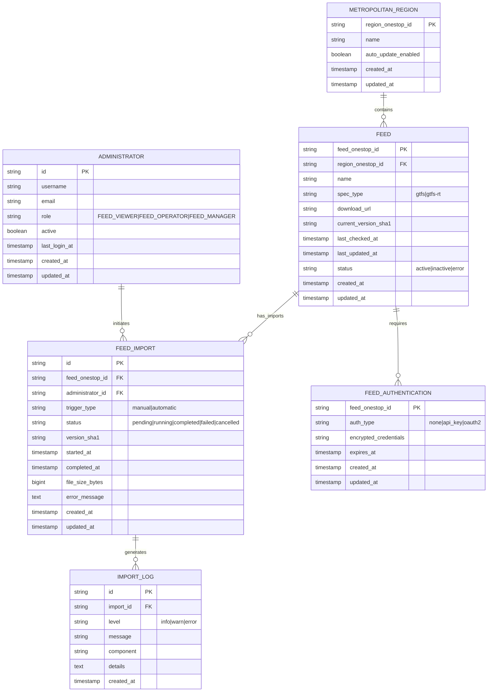

# Feed Management Data Model

**Feature**: Feed Management System | **Date**: 2025-01-09

## Entity Relationships



## Core Entities

### Metropolitan Region

Represents a geographical area with available transit data from Transit.land.

**Attributes**:
- `region_onestop_id`: Primary key using Transit.land region Onestop ID (e.g., "r-9q8y-montreal")
- `name`: Human-readable region name (e.g., "Montreal", "San Francisco Bay Area")
- `auto_update_enabled`: Whether daily automatic updates are enabled
- `created_at` / `updated_at`: Standard audit timestamps

**Validation Rules**:
- `region_onestop_id` must follow Transit.land Onestop ID format (r-{geohash}-{name})
- `name` must be non-empty
- `auto_update_enabled` defaults to true for new regions

### Feed

Represents an individual GTFS or GTFS-RT feed from a transit agency.

**Attributes**:
- `feed_onestop_id`: Primary key using Transit.land feed Onestop ID (e.g., "f-f25d-socitdetransportdemontreal")
- `region_onestop_id`: Foreign key to Metropolitan Region
- `name`: Feed display name (e.g., "STM GTFS", "MTA Real-time")
- `spec_type`: Feed specification type (gtfs, gtfs-rt)
- `download_url`: Current download URL for the feed
- `current_version_sha1`: Transit.land SHA1 version identifier for change detection
- `last_checked_at`: Last time feed was checked for updates
- `last_updated_at`: Last time feed content was actually updated
- `status`: Current feed status (active, inactive, error)

**Validation Rules**:
- `feed_onestop_id` must follow Transit.land Onestop ID format (f-{geohash}-{operator})
- `spec_type` must be either "gtfs" or "gtfs-rt"
- `download_url` must be valid HTTP/HTTPS URL
- `current_version_sha1` must be valid SHA1 hex string (40 characters)
- `status` must be one of defined enum values

### Feed Authentication

Stores authentication credentials for accessing protected feeds.

**Attributes**:
- `feed_onestop_id`: Primary key and foreign key to Feed
- `auth_type`: Authentication method (none, api_key, oauth2)
- `encrypted_credentials`: Encrypted authentication data (JSON)
- `expires_at`: Credential expiration time (for OAuth tokens)

### Feed Import

Represents a single import operation for a feed. Stores only persistent state - transient progress data handled in-memory.

**Attributes**:
- `id`: Unique identifier (UUID) - imports need unique tracking beyond feed identity
- `feed_onestop_id`: Foreign key to Feed
- `administrator_id`: Foreign key to Administrator (null for automatic imports)
- `trigger_type`: How import was initiated (manual, automatic)
- `status`: Current import status (pending, running, completed, failed, cancelled)
- `version_sha1`: Transit.land SHA1 of the imported feed version
- `started_at`: Import start timestamp
- `completed_at`: Import completion timestamp
- `file_size_bytes`: Size of downloaded feed file (for historical analysis)
- `error_message`: Error description if import failed

**Transient Progress Data (In-Memory/Redis)**:
- `progress_percentage`: Completion percentage (0-100)
- `total_steps`: Total number of import steps
- `current_step`: Description of current processing step
- `estimated_time_remaining_seconds`: Estimated completion time

### Import Log

Detailed logging for import operations.

**Attributes**:
- `id`: Unique identifier (UUID)
- `import_id`: Foreign key to Feed Import
- `level`: Log level (info, warn, error)
- `message`: Human-readable log message
- `component`: Processing component that generated log
- `details`: Extended details in JSON format
- `created_at`: Log entry timestamp

### Administrator

Users with permission to manage feed imports.

**Attributes**:
- `id`: Unique identifier (UUID)
- `username`: Unique username for login
- `email`: Administrator email address
- `role`: Access level (FEED_VIEWER, FEED_OPERATOR, FEED_MANAGER)
- `active`: Whether account is active
- `last_login_at`: Last successful login timestamp

**Role Permissions**:
- **FEED_VIEWER**: View import progress and history
- **FEED_OPERATOR**: Initiate and cancel imports, plus viewer permissions
- **FEED_MANAGER**: Configure regions and authentication, plus operator permissions

## Database Schema (PostgreSQL)

### Tables

```sql
-- Enable UUID extension
CREATE EXTENSION IF NOT EXISTS "uuid-ossp";

-- Metropolitan regions table using Onestop IDs
CREATE TABLE metropolitan_regions (
    region_onestop_id VARCHAR(255) PRIMARY KEY, -- e.g., "r-9q8y-montreal"
    name VARCHAR(255) NOT NULL,
    auto_update_enabled BOOLEAN NOT NULL DEFAULT true,
    created_at TIMESTAMP WITH TIME ZONE NOT NULL DEFAULT NOW(),
    updated_at TIMESTAMP WITH TIME ZONE NOT NULL DEFAULT NOW()
);

-- Feeds table using Onestop IDs
CREATE TABLE feeds (
    feed_onestop_id VARCHAR(255) PRIMARY KEY, -- e.g., "f-f25d-socitdetransportdemontreal"
    region_onestop_id VARCHAR(255) NOT NULL REFERENCES metropolitan_regions(region_onestop_id),
    name VARCHAR(255) NOT NULL,
    spec_type feed_spec_type NOT NULL,
    download_url TEXT NOT NULL,
    current_version_sha1 VARCHAR(40), -- Transit.land SHA1 for change detection
    last_checked_at TIMESTAMP WITH TIME ZONE,
    last_updated_at TIMESTAMP WITH TIME ZONE,
    status feed_status NOT NULL DEFAULT 'active',
    created_at TIMESTAMP WITH TIME ZONE NOT NULL DEFAULT NOW(),
    updated_at TIMESTAMP WITH TIME ZONE NOT NULL DEFAULT NOW()
);

-- Feed authentication table using Onestop ID as PK
CREATE TABLE feed_authentication (
    feed_onestop_id VARCHAR(255) PRIMARY KEY REFERENCES feeds(feed_onestop_id) ON DELETE CASCADE,
    auth_type auth_type NOT NULL DEFAULT 'none',
    encrypted_credentials TEXT,
    expires_at TIMESTAMP WITH TIME ZONE,
    created_at TIMESTAMP WITH TIME ZONE NOT NULL DEFAULT NOW(),
    updated_at TIMESTAMP WITH TIME ZONE NOT NULL DEFAULT NOW()
);

-- Administrators table (UUIDs for user management)
CREATE TABLE administrators (
    id UUID PRIMARY KEY DEFAULT uuid_generate_v4(),
    username VARCHAR(255) NOT NULL UNIQUE,
    email VARCHAR(255) NOT NULL UNIQUE,
    role admin_role NOT NULL,
    active BOOLEAN NOT NULL DEFAULT true,
    last_login_at TIMESTAMP WITH TIME ZONE,
    created_at TIMESTAMP WITH TIME ZONE NOT NULL DEFAULT NOW(),
    updated_at TIMESTAMP WITH TIME ZONE NOT NULL DEFAULT NOW()
);

-- Feed imports table (UUIDs for unique import tracking)
-- Only persistent state - transient progress stored in Redis
CREATE TABLE feed_imports (
    id UUID PRIMARY KEY DEFAULT uuid_generate_v4(),
    feed_onestop_id VARCHAR(255) NOT NULL REFERENCES feeds(feed_onestop_id),
    administrator_id UUID REFERENCES administrators(id),
    trigger_type import_trigger_type NOT NULL,
    status import_status NOT NULL DEFAULT 'pending',
    version_sha1 VARCHAR(40), -- Transit.land SHA1 of imported version
    started_at TIMESTAMP WITH TIME ZONE,
    completed_at TIMESTAMP WITH TIME ZONE,
    file_size_bytes BIGINT,
    error_message TEXT, -- Error details if import failed
    created_at TIMESTAMP WITH TIME ZONE NOT NULL DEFAULT NOW(),
    updated_at TIMESTAMP WITH TIME ZONE NOT NULL DEFAULT NOW()
);

-- Import logs table
CREATE TABLE import_logs (
    id UUID PRIMARY KEY DEFAULT uuid_generate_v4(),
    import_id UUID NOT NULL REFERENCES feed_imports(id) ON DELETE CASCADE,
    level log_level NOT NULL,
    message TEXT NOT NULL,
    component VARCHAR(255),
    details JSONB,
    created_at TIMESTAMP WITH TIME ZONE NOT NULL DEFAULT NOW()
);

-- Custom types
CREATE TYPE feed_spec_type AS ENUM ('gtfs', 'gtfs-rt');
CREATE TYPE feed_status AS ENUM ('active', 'inactive', 'error');
CREATE TYPE auth_type AS ENUM ('none', 'api_key', 'oauth2');
CREATE TYPE admin_role AS ENUM ('FEED_VIEWER', 'FEED_OPERATOR', 'FEED_MANAGER');
CREATE TYPE import_trigger_type AS ENUM ('manual', 'automatic');
CREATE TYPE import_status AS ENUM ('pending', 'running', 'completed', 'failed', 'cancelled');
CREATE TYPE log_level AS ENUM ('info', 'warn', 'error');
```

### Indexes

```sql
-- Performance indexes
CREATE INDEX idx_feeds_region_onestop_id ON feeds(region_onestop_id);
CREATE INDEX idx_feeds_status ON feeds(status);
CREATE INDEX idx_feeds_last_checked ON feeds(last_checked_at);
CREATE INDEX idx_feeds_spec_type ON feeds(spec_type);

CREATE INDEX idx_feed_imports_feed_onestop_id ON feed_imports(feed_onestop_id);
CREATE INDEX idx_feed_imports_status ON feed_imports(status);
CREATE INDEX idx_feed_imports_created_at ON feed_imports(created_at DESC);
CREATE INDEX idx_feed_imports_trigger_type ON feed_imports(trigger_type);

CREATE INDEX idx_import_logs_import_id ON import_logs(import_id);
CREATE INDEX idx_import_logs_level ON import_logs(level);
CREATE INDEX idx_import_logs_created_at ON import_logs(created_at DESC);

CREATE INDEX idx_administrators_role ON administrators(role);
CREATE INDEX idx_administrators_active ON administrators(active);
```

## Progress Tracking Architecture

### Database: Persistent State Only
- Import records with major state transitions
- Final results and error information
- Historical data for analysis and auditing

### Redis: Transient Progress Data
```kotlin
data class ImportProgress(
    val importId: String,
    val progressPercentage: Int,
    val totalSteps: Int,
    val currentStep: String,
    val estimatedTimeRemainingSeconds: Int?
)

@Service
class ImportProgressService(private val redisTemplate: RedisTemplate<String, Any>) {

    fun updateProgress(importId: String, progress: ImportProgress) {
        redisTemplate.opsForValue().set("import:progress:$importId", progress, Duration.ofHours(2))
    }

    fun getProgress(importId: String): ImportProgress? {
        return redisTemplate.opsForValue().get("import:progress:$importId") as ImportProgress?
    }
}
```

### WebSocket: Real-time Updates
```kotlin
@Controller
class ImportProgressWebSocketHandler {

    @MessageMapping("/import/progress/{importId}")
    @SendTo("/topic/import/progress/{importId}")
    fun broadcastProgress(importId: String, progress: ImportProgress) {
        return progress
    }
}
```

## Change Detection Strategy

**Using Transit.land SHA1**: Feed updates are detected by comparing the `current_version_sha1` stored in our database with the latest SHA1 from Transit.land API:

1. **Daily Check**: Query Transit.land for latest feed versions
2. **SHA1 Comparison**: Compare API SHA1 with stored `current_version_sha1`
3. **Import Trigger**: If SHA1 differs, trigger automatic import
4. **Update Record**: Store new SHA1 after successful import

**Benefits**:
- **Clean separation**: Persistent business data vs. transient progress state
- **Reduced database load**: No constant writes during imports
- **Better performance**: Redis for high-frequency updates
- **Real-time UI**: WebSocket updates without database polling